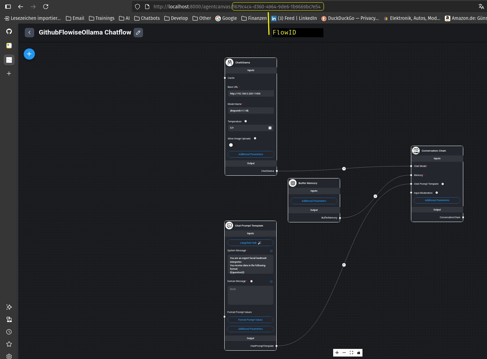

# FlowiseMesh - Textual Facedescription with LLM

## License 
**Google Mediapipe**, **flowiseai/flowise** in Dockerhub and **Ecal** are licensed under [Apache Version 2.0](https://www.apache.org/licenses/LICENSE-2.0). This repo follows the licence terms.

## Project Description
The Goal of this project is to connect external programs with a Large Language Model, designed and running in Flowise. The usecase is a life cam stream of a face decorated with **Google Mediapipe** generated landmarks as an input to a **Flowise**-model running in docker container. The model, locally an **Ollama** model or **Openai** interfaced via API, should interpret the data and post the result outside of the container.  The following link points to the Flowise homepage. 
> [Flowise - # Build AI Agents Visually ](https://flowiseai.com/)

## Installation

### Step 1:
Docker installation

> [Installation Ubuntu](https://www.datacamp.com/tutorial/install-docker-on-ubuntu)

> [Installation Windows 11 / WSL2](https://docs.docker.com/desktop/features/wsl/)

### Step 2:
Flowise is for free and we will install a Docker image from the Docker Hub
> [FlowiseAI from the Dockerhub](https://hub.docker.com/r/flowiseai/flowise)

    docker pull flowiseai/flowise

### Step3:
a) Local Models - Install **Ollama**

> [Link to OLLAMA](https://ollama.com/)

Download the preferred model, eg

    ollama pull deepseek-r1:14b
b) Cloud-based
Create an API key, eg. OpenAI:

    https://platform.openai.com/api-keys

and import the API - Key to Flowise

### Step 4:
We are using a virtual python environment, eg pyenv or conda. 

 - [**pyenv usage**](https://realpython.com/intro-to-pyenv/) 
 - [**conda usage**](https://www.geeksforgeeks.org/set-up-virtual-environment-for-python-using-anaconda/)
 - Create your virtual environment based on **Python 3.12**, here we name it **ecal**.
 - Activate the env
 
   `pyenv activate ecal` 

### Step 5:
Install the requirements:

    pip install -r requirements.txt

### Step 6:
Install the communication layer **ECAL**
[Landing page of ECAL](https://eclipse-ecal.github.io/ecal/stable/index.html)

[Download the latest version](https://eclipse-ecal.github.io/ecal/releases/)

Install in your virtual environment also the **Python Binding**, eg. 
For Linux:

    pip install ecal5-5.13.3-1jammy-cp311-cp311-linux_x86_64.whl

For Windows:

    pip install ecal5-5.13.3-cp311-cp311-win_amd64.whl

### Step 7: Configuring .env
.env looks something like this:

    ###### FLOWISE ID NUMBER 
    # Ollama Model 
    # FLOWID = <Your Flowise ID>
    # OpenAI Model
    FLOWID = <Your Flowise ID>
    ###### Module Selection - VALID only for NON-Docker Application
    # USECAM = False -> Sample image is used
    # USECAM = True -> Webcam is used
    # USECAM = False
    USECAM = True
    ###### Picture Selection
    FOLDER = Images/
    # IMAGE = base.png
    # IMAGE = looking_right.jpg
    # IMAGE = looking_left.jpg
    IMAGE = smiling.jpg

Your Flowise ID can be found here:

## Elements of the Software

### A) Communication Layer ECAL
eCAL (**e**nhanced **C**ommunication **A**bstraction **L**ayer) is a fast publish-subscribe middleware that can manage inter-process data exchange, as well as inter-host communication.
It comes with some tools, like the  **ECAL-Monitor** and the **ECAL-Player**.

It is based on Protobuf messages.
The documentation can be found here: [Protocol Buffers Documentation](https://protobuf.dev/)
The proto files in this project are:
 - facedata.proto
 - modeloutput.proto

They can be compiled by the command:

`protoc -I =. --python_out=. facedata.proto`

`protoc -I =. --python_out=. modeloutput.proto`
 

### B) Using Facemesh from Google Mediapie

For **Facedetection** we are using **Google Mediapipe**. [Link here](https://developers.google.com/mediapipe/solutions). From this we are using the solutions [Face Landmarker](https://developers.google.com/mediapipe/solutions/vision/face_landmarker). The canonical Face Landmark Model is shown here: [Canonical Face Model](https://github.com/google/mediapipe/issues/1854). The model, used here, can be found on [mediapipe solutions](https://github.com/google/mediapipe/blob/master/docs/solutions/models.md).
The module facedata2ecal.py is based on a modified example provided by Google.

## Starting up the Project

### Running on:
#### Ubuntu
> #### [Plain Setup](./doc/ubuntu_plain.md)

> #### [Docker Setup](./doc/ubuntu_docker.md)

#### Windows

### Annotation
Using the  **Microsoft Lifecam HD3000**, you can adjust the video frame.
Keyboard shortcuts that you can use to manage the zoom out/in feature of camera:
> **Zoom Out = Ctrl + Minus Key, Zoom In = Ctrl + Plus key, Zoom to 100% = Ctrl + Zero key**

> Written with [StackEdit](https://stackedit.io/).

