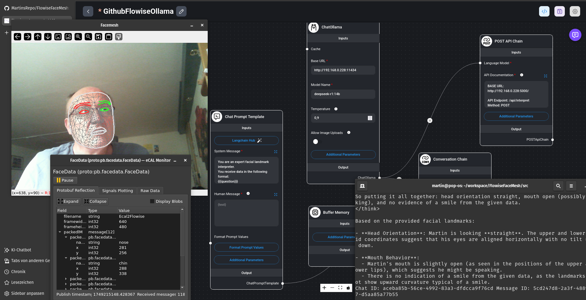

# FlowiseMesh - Textual Facedetection with LLM

## License 
**Google Mediapipe**, **flowiseai/flowise** in Dockerhub and **Ecal** are licensed under [Apache Version 2.0](https://www.apache.org/licenses/LICENSE-2.0). This repo follows the licence terms.

## Installation
The Goal of this project is to connect external programs with a Large Language Model, designed and running in Flowise.
> [Flowise - # Build AI Agents Visually ](https://flowiseai.com/)

### Step 1:
Flowise is for free and we will install a Docker image from the Docker Hub
> [FlowiseAI from the Dockerhub](https://hub.docker.com/r/flowiseai/flowise)

    docker pull flowiseai/flowise

Then we start a container mapped to an external volume to store the projects permanently:

    docker run 	-d --name flowise \
			    -v <your local folder>/root/.flowise \
			    -p 8000:3000 flowise
After one or two minutes, you can access flowise in

    http://localhost:8000/

### Step2:
Open the sidetab Chatflows or Agentflows and add a new one:

 - Import one model as JSON from src/FlowiseModel. 
 - Two models are available: 
 - *GithubFlowiseOpenAI Chatflow.json* or *Visual Chatflow Deepseek_Ollama.json*
 - In the OpenAI version, add your OpenAI API Key in the chatModel.
 - In the local Ollama version, make sure, that:
> your Ollama Server is started with:

    OLLAMA_HOST=0.0.0.0:11434 ollama serve
> and your ChatOllama in your imported Flowise model is set to: 

    http://"your local PC IPaddress":11434

> Select the model with the name, eg. 

`deepseek-r1:14b`

### Step 3:
Install the requirements.txt in a virtual python environment, eg pyenv or conda. 

 - [**pyenv usage**](https://realpython.com/intro-to-pyenv/) 
 - [**conda usage**](https://www.geeksforgeeks.org/set-up-virtual-environment-for-python-using-anaconda/)

Here, i used the env name: **ecal**

    pip install -r requirements.txt

### Step 4: 
Open two command windows, goto to your workspace and start the environment with eg.

    pyenv activate ecal

### Step 5: 
Install ECAL:
[Landing page of ECAL](https://eclipse-ecal.github.io/ecal/stable/index.html)
[Download the latest version](https://eclipse-ecal.github.io/ecal/releases/)
Install in your virtual environment also the **Python Binding**

## What the Software is doing

### A) What is ECAL?
eCAL (**e**nhanced **C**ommunication **A**bstraction **L**ayer) is a fast publish-subscribe middleware that can manage inter-process data exchange, as well as inter-host communication.
It comes with some tools, like th eECAL-Monitor and the ECAL-Player.
It is based on Protobuf messages, in our case like this:

Model Input

    syntax = "proto3";
    package pb.facedetection;
    message FD{
	    string filename = 1;
	    int32 framewidth = 2;
	    int32 frameheight = 3;
	    repeated Landmarks packedlM = 4; //array of landmark data, packaged to reduce sampling rate
	    repeated FaceOval packedFO = 5; // Additional face oval landmarks
	 }
	message Landmarks{
	    string name = 1;
	    int32 x = 2;
	    int32 y = 3;
	}
	message FaceOval{
	    string name = 1;
	    int32 x = 2;
	    int32 y = 3;
	}

	syntax = "proto3";

Model output

	package pb.flask;
	message OUT{
    string headline = 1;
    string text = 2;
    }

So, the camera und the LLM model must not be on the same PC, PC - Raspberry also works.
If need - compile the Proto-file:

    protoc -I =. --python_out=. facemesh.proto
    protoc -I =. --python_out=. modeloutput.proto

### B) What is a Facemesh?

For **Facedetection** we are using **Google Mediapipe**. [Link here](https://developers.google.com/mediapipe/solutions). From this we are using the solutions [Face Landmarker](https://developers.google.com/mediapipe/solutions/vision/face_landmarker) and [Hand Landmarker](https://developers.google.com/mediapipe/solutions/vision/hand_landmarker). The canonical Face Landmark Model is shown here: [Canonical Face Model](https://github.com/google/mediapipe/issues/1854). The model, used here, can be found on [mediapipe solutions](https://github.com/google/mediapipe/blob/master/docs/solutions/models.md).

### C) Running the Modules
### Step 1:
Import the Flowise model from your **src/FlowiseModel** path in the Flowise broswer tab:

- Create a new Agent Flow or Chat Flow by pressing **Add New** and
- **Load Chatflow** from the settings tab, eg: **GithubFlowiseOpenAI Chatflow.json**

- Save the model after adding your creditentials
### Step 2:
 - Adapt your .env files with the correct Flowise ID (to be found on the project browser tab and looks something like: adb94663-c66b-49f7-87f1-7788aff22a7a
 - Open 3 terminal windows, activate the virtual environment and go the src folder
 - Run in the first terminal window : **python facemesh2ecal.py**
 - Run in the second terminal window: ** python ecal2flowise.py**
 - Run in the third terminal window : **flaskendpoint.py**

The result will something like this:

and the Ecal Messages are:

### Annotation
Using the  **Microsoft Lifecam HD3000**, you can adjust the video frame.
Keyboard shortcuts that you can use to manage the zoom out/in feature of camera:
> **Zoom Out = Ctrl + Minus Key, Zoom In = Ctrl + Plus key, Zoom to 100% = Ctrl + Zero key**

> Written with [StackEdit](https://stackedit.io/).
