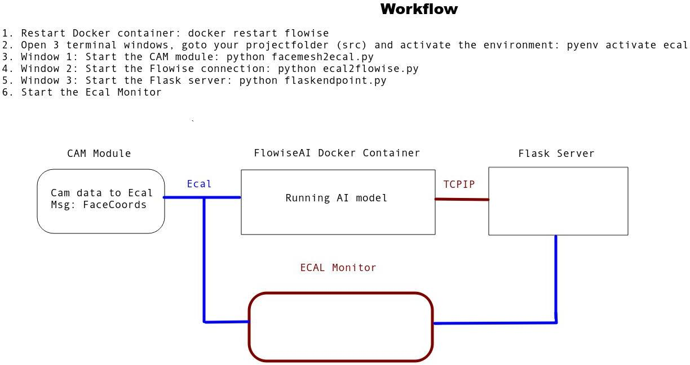
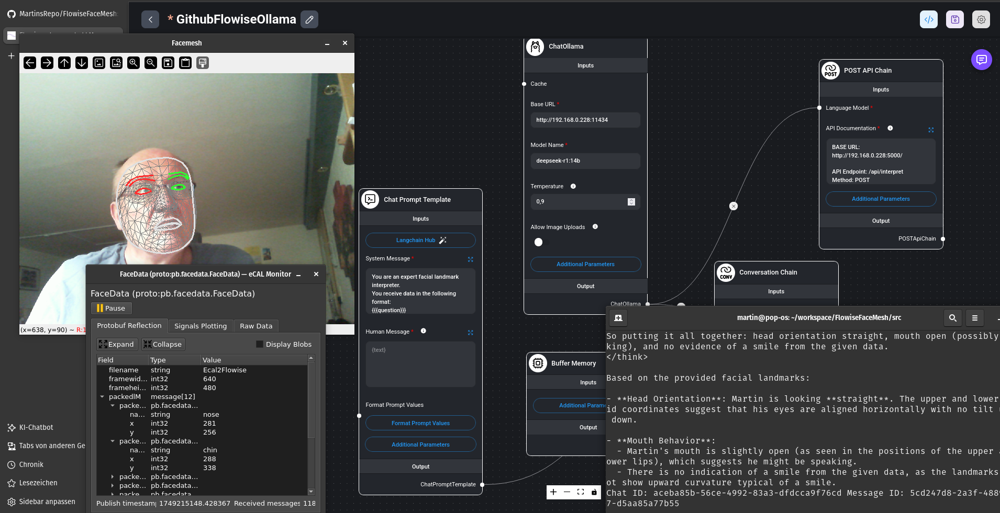
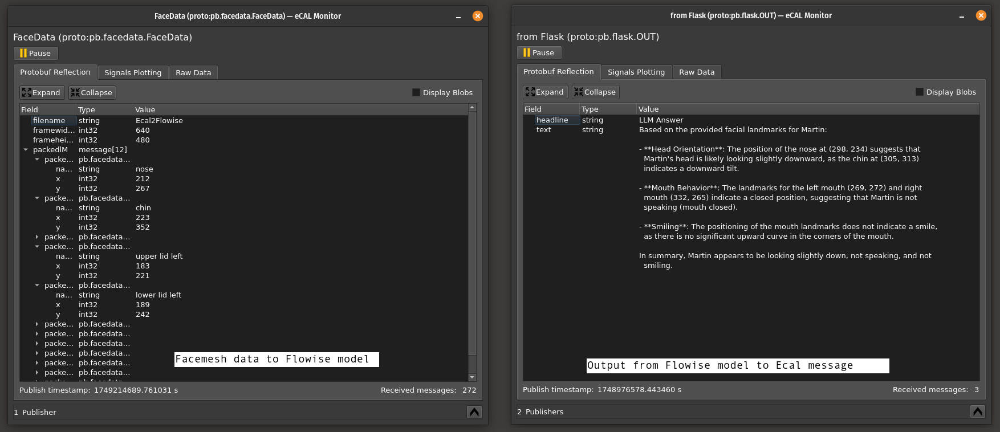

## Workflow

##  Installation

### Step1
Then we start a container mapped to an external volume to store the projects permanently:

    docker run 	-d --name flowise \
			    -v <your local folder>/root/.flowise \
			    -p 8000:3000 flowise
    or once started:
    
or once started:

docker restart flowise`

After one or two minutes, you can access flowise in

    http://localhost:8000/

### Step2:
Open the sidetab Chatflows or Agentflows and add a new one:

 - Import one model as JSON from **src/FlowiseModel**. 
 - Two models are available: 
	 - *GithubFlowiseOpenAI Chatflow.json* or *Visual Chatflow Deepseek_Ollama.json*
 - In the OpenAI version, add your **OpenAI API Key** in the chatModel.
 - In the local Ollama version, make sure, that:
> your Ollama Server is started with:

    OLLAMA_HOST=0.0.0.0:11434 ollama serve
> and your ChatOllama in your imported Flowise model is set to: 

    http://"your local PC IPaddress":11434

> Select the model with the name, eg. 

`deepseek-r1:14b`

After finishing, save the model.

### Step 3:
 - Adapt your .env files with the correct Flowise ID (to be found on the project browser tab and looks something like: adb94663-c66b-49f7-87f1-7788aff22a7a
 - Open 3 terminal windows, activate the virtual environment and go the src folder
 - Run in the first terminal window : 

	`python facemesh2ecal.py`
    
 - Run in the second terminal window: 

	`python ecal2flowise.py`
    
 - Run in the third terminal window : 

	`python flaskendpoint.py`

### Step 4:
The result will something like this:

and the Ecal Messages are:

> Written with [StackEdit](https://stackedit.io/).
